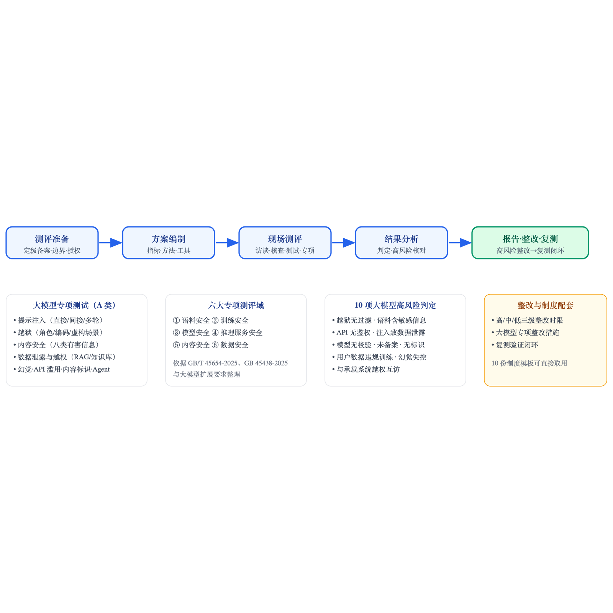

# 等保大模型测评 Skill（Dengbao LLM Assessment）

面向大模型系统的网络安全等级保护测评方法体系。以 GB/T 22239-2019《网络安全等级保护基本要求》、GB/T 28448-2019《网络安全等级保护测评要求》为基线，融合 **T/ISEAA 006-2024《大模型系统安全测评要求》**（与 T/ISEAA 005-2024《大模型系统安全保护要求》配套）、**大模型扩展要求**、**GB/T 45654-2025《网络安全技术 生成式人工智能服务安全基本要求》**、**GB 45438-2025《网络安全技术 人工智能生成合成内容标识方法》** 与 **2025版《网络安全等级保护测评高风险判定指引》**，提供可直接落地执行的测评方法、测评步骤、整改要求与管理制度文件。

> 本仓库为 AI 助手（Claude/OpenClaw 等）可加载的 Skill 包，也可作为测评人员的手册直接阅读。

## 目录结构

```
大模型测评 skill/
├── SKILL.md                          # Skill 主入口（AI 加载此文件）
├── README.md                         # 本说明
├── 等保大模型测评方法总览.html        # 方法体系总览（浏览器直接打开）
├── references/                       # 测评知识库（按需加载）
│   ├── 01-测评方法与测评步骤.md       # 测评方法、五阶段操作步骤
│   ├── 02-技术类测评项清单.md         # 五大技术类控制点测评项全清单
│   ├── 03-管理类测评项清单.md         # 五大管理类控制点测评项全清单
│   ├── 04-大模型专项测评要点.md       # 语料/训练/模型/推理/内容/数据六域专项
│   ├── 05-整改要求与整改流程.md       # 整改分级、整改建议、验收复测
│   ├── 06-高风险判定指引.md           # 2025版高风险判定 + 大模型高风险项
│   ├── 07-大模型专项测试用例库.md     # 提示注入/越狱/内容安全等现成测试用例
│   └── 08-T-ISEAA006-2024标准映射.md # 006 条款级映射（5~10 章逐条对应+反查表）
├── assets/
│   ├── 制度文件模板/                  # 等保大模型扩展要求配套 10 份管理制度模板
│   └── 模板/                         # 测评方案/记录表/报告/整改计划模板
└── 等保大模型测评方法总览.html
```

## 总览图



## 快速使用

**测评人员**：从 `references/02`、`references/03` 选取测评项 → 按 `references/01` 实施 → 对照 `references/06` 判高风险 → 按 `references/05` 出整改要求 → 用 `assets/模板/` 出报告 → 用 `assets/制度文件模板/` 补齐制度。

**AI 助手**：将本目录作为 Skill 加载，读取 `SKILL.md` 后按导航自动加载对应 reference 文件。

## 依据的标准与文件

| 标准/文件 | 状态 | 用途 |
|---|---|---|
| GB/T 22239-2019 网络安全等级保护基本要求 | 现行 | 通用安全要求基线 |
| GB/T 28448-2019 网络安全等级保护测评要求 | 现行 | 测评方法与判定依据 |
| 网络安全等级保护基本要求 大模型扩展要求 | 征求意见稿（以正式发布稿为准） | 大模型专项控制点 |
| GB/T 45654-2025 生成式人工智能服务安全基本要求 | 2025-11-01 实施 | 语料/模型/内容安全要求 |
| GB 45438-2025 人工智能生成合成内容标识方法 | 2025-09-01 实施（强制） | 生成内容标识 |
| 网络安全等级保护测评高风险判定指引（2025版） | 现行 | 高风险判定 |
| TC260-004 政务大模型应用安全规范 | 已发布 | 政务场景参考 |
| OWASP LLM Top 10 | 外部参考 | 大模型应用威胁模型 |

## 说明

- 测评项编号沿用等保通用框架（如"安全计算环境-身份鉴别 a)…"），大模型扩展项以「LLM-」前缀标识，便于与通用项区分。
- 大模型扩展要求目前处于征求意见稿阶段，正式发布后请以正式文本核对控制点编号与措辞。
- 本仓库内容仅供测评工作参考，不构成法律意见；具体测评以委托合同与监管要求为准。

## License

MIT
